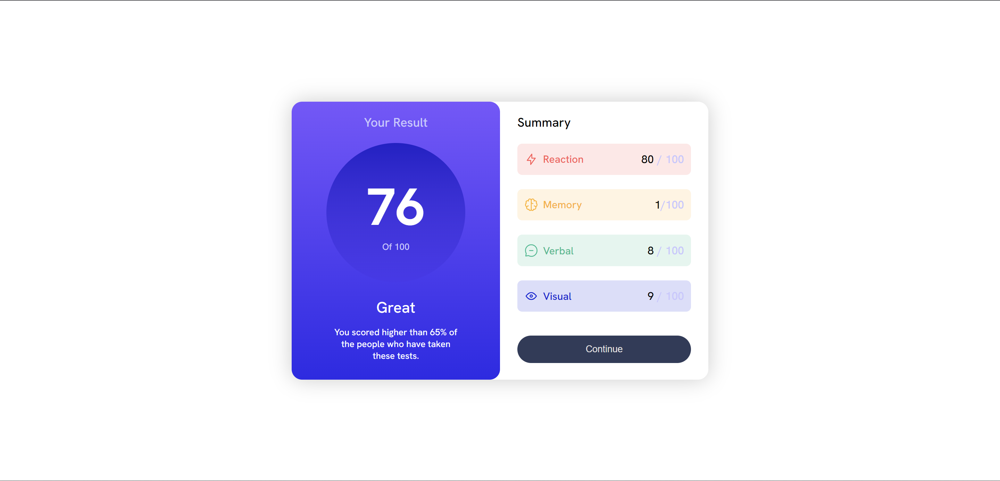

# Frontend Mentor - QR code component solution

This is a solution to the [QR code component challenge on Frontend Mentor](https://www.frontendmentor.io/challenges/results-summary-component-CE_K6s0maV). 

### Screenshot

### Links

- Live Site URL: https://karoljaworski.github.io/front-end-mentor-tasks/solutions/task1/

### Built with

- Semantic HTML5 markup
- Flexbox
- CSS Grid